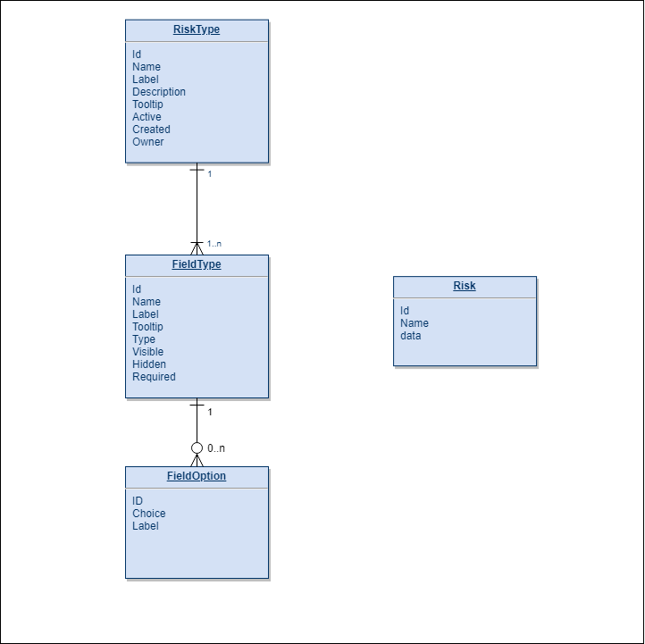

BCE App
=======
This repository contains my solution to the problem of creating variable risk types for the BriteCore Engineering Code Challenge.
The app itself is live and can be accessed from the urls in the tl;dr

# TL;DR
## Deliverables

1. This file
2. Links to the live app are [Listed Here](#ui)
3. Model file can be [found here](bce-server/bce/models.py) and [here](doc/models.py)
4. The entity diagram can be [found here](doc/Entities.png), and  [here](#entities)
5. Backend Api link can is [shown here](#server) 
6. Can be checked [here](bce-server/bce/views.py)
7. Live UI app is linked [here](#ui) along with the details to log in and test 
8. Same as above
9. If you are reading this then you've made it to the github repo, lol. But [here is the link anyway](https://github.com/phoexer/bce)
10. Quiz file is [here](doc/quiz.py)
11. And finally [Live app is here](https://bce.musangeya.com) and user guide [can be found here](doc/guide.md)
12. Sent
     
     
## <a name="ui"></a>UI
The following link points to the app's frontend. The frontend is hosted on my one of my linodes and 
accesses the backend server which runs on Amazon Lambda.

* [bce.musangeya.com](https://bce.musangeya.com)

I originally wrote the UI using Angular because that was the framework I was most comfortable with.
However after finishing, I decided to see what I could learn about Vue.js because it was mentioned as 
an option in the requirement document.

One thing led to another, and I now have the UI written in Vue.js as well. The link above leads 
to the Vue.js version of the app.

The old Angular app can be viewed using the link below

*  [bce-ng.musangeya.com](https://bce-ng.musangeya.com)

Both Apps are pretty much identical and access the same backend. The code for both is in the repository,
i.e. [bce-vue-ui](bce-vue-ui) for the Vue.js app and [bce-angular-ui](bce-angular-ui) for the angular app.

## <a name="server"></a>Api
The Api can be accessed  at
* [https://jmeqhog3qj.execute-api.us-east-2.amazonaws.com/dev/api](https://jmeqhog3qj.execute-api.us-east-2.amazonaws.com/dev/api)

## Solution Architecture 
The Solution comes in two parts, the first is the backend API written in Django using the Rest Framework.
The second is the UI written in Angular
Communication between the two is in json, and there is currently basic JWT token authentication in place.

### The Server
The server provides a JSON API that allows one to manipulate RiskTypes.
Sample JSON structures for this api [can be found here](samples) along with a few python scripts
that make calls to the api

Before any calls are made to the api though you need to get authenticate and receive a JWT Token
which you will use for all other communication.

#### Endpoints
|Endpoint|Description|
|---|---|
|api-token-auth/|Authentication Endpoint, get your tokens here|
|risk-types/|Create, Read, Update and Delete RiskTypes here.|
|risks/|Create, Read, Update and Delete Risks here.|

         
## Data Level Overview
Requirement is to create a solution that allow insurers to create their own data models for their risks.
I tackled this by creating three models, RiskType,FieldType and FieldOption.
These three allows users to define their own Risk data models and forms. 

### RiskType
RiskType is the basic object and contains general data about the risk type such as it's name, label that 
will appear on the form and a description. Each RiskType can have multiple FieldTypes.

#### Attributes

|Attribute|Description|
|---------|----------|
|Name| A name to identify an instance of RiskType|
|Label|A Label that will be displayed on the Risk Data Model|
|Description|Description or noted about the RiskType|
|Tooltip|Helpful Information that is displayed when you mouse over a component|
|Active|Flag that determines is the RiskType is active or not|
|fields|A list of fieldTypes attached to this RiskType|
|Created|Date Created|
|Owner|Owner of the RiskType|


### FieldType
Field Types represent a single field for the risk data model. Each field type has it's own name, type
and label which determine how it will behave on the front end.
For enumerated types FieldType can have multiple Options. The solution supports two types of enumerated types:

* Radio Buttons
* Dropdown Boxes

#### Attributes

|Attribute|Description|
|---------|----------|
|Name| A name to identify an instance of RiskType|
|Label|A Label that will be displayed on the Risk Data Model|
|Type| Determines field type, i.e. Is it Text, Number, Email, Date, Dropdown etc.|
|Tooltip|Helpful Information that is displayed when you mouse over a component|
|Required|Flag that determines if the field will be required|
|Visible|Flag that determines if the field is visible|
|Hidden|Flag that determines if the field is a hidden field|
|Options|A list of Options for an enumerated type|
 

### Field Option
This is used for enumerated types and contains a key and value describing the options available.

### Risk
The UI application demonstrates how forms are generated, and on submit they create json objects 
that can be parsed and worked on. For this demo however I just encoded the object and saved it to 
database.
The Risk Model receives the name, type and data for a new Risk and saves it to db. 


### <a name="entities"></a>Entities 


## Deploying

The back end runs on Amazon AWS lambda, to deploy:

#### Requirements

1. Set up Amazon
    1. You need an Amazon account and you need to create appropriate AWS Access Key and Secret Access key.
    2. you need a RDS running postgres database
    3. S3 instance if you plan to deploy the angular site on Amazon

2. download this repository to your working directory

    ```sh
        git clone git@github.com:phoexer/bce.git
    ```

3. Create your python environment

    ```sh
        cd bce
        virtualenv env
    ```
    
4. Install dependencies

    ```sh
        pip install -r requirements.txt
    ```

5. Configure Zappa
    copy the zappa_settings.bak.json to zappa_settings.json and edit the zappa_settings.json file with your own settings.  
    Or alternatively you can run ```zappa init``` to generate a new one   
    
6. copy the settings.bak.py to settings.py and go through it with your own details. Of Note are the following:
    1. SECRET_KEY
    2. ALLOWED_HOSTS
    3. DATABASES
    4. YOUR_S3_BUCKET
    5. AWS_ACCESS_KEY_ID
    6. AWS_SECRET_ACCESS_KEY
    7. CORS_ORIGIN_WHITELIST

7. Once you are done you should be ready to deploy ad create a default user
    ```
        zappa deploy
        zappa migrate
        zappa invoke --raw dev "from django.contrib.auth.models import User; User.objects.create_superuser('admin', 'admin@phoexer.com', 'ncdBXf5KBFTKyeFqLp8E')" 
    ``` 
8. To get the single page app up, you run
    ```python manage.py collectstatic --noinput```
    
    or copy the contents [bce-ui/dist](bce-ui/dist) into a web server like apache
         
If everything went well you should now have the api running on lambda.
