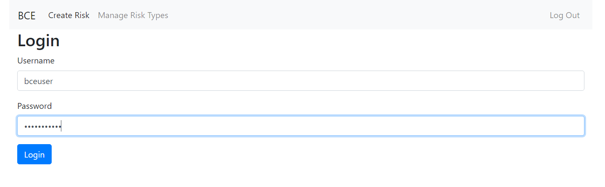

User Guide
==========

This app is pretty simple and straight forward to use. 
This document give the basic information on how it works.

## Getting Started
You can access the app at [https://bce.musangeya.com](https://bce.musangeya.com). Following this link will take you to 
the login page shown bellow.

### Default User
|User|Password|
|---|---|
|bceuser|password123|

## Creating Risk Types
To create a new risk type you click the Risk Type menu item in the top bar. 

This give you the above form. Here you fill in general details about the new Risk Type model.
When You are done here you can now start creating fields.

The green box represents a single field. You can add more fields by pressing the add ore button 
bellow the fields section.

 
Each Field allows you to select a field type, this will determine how it is handled on the form.
For those fields that need multiple selection, i.e. radio buttons or dropdowns, once you
select them, you will be given more options.

When you are done, you can click save to save your new Risk Type.

## Creating A New Risk
Once it is saved, you can navigate to the Risk page using

You will notice that the fields you defined now appear as a form. It's important to that the order
which the fields are created is the order which they are displayed here.

You can fill out the form and save, the data will be saved on the server. 
